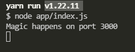

# **SportSee application**

### Prerequisites

1. node.js (v14.17.6)
2. yarn (v1.22.11)

### Installation

The application needs a few librairies & packages to work.
You will need to install Recharts (render Charts), React Router(to ensure the routing system in the application), Proptypes is utilised to check the type of props.

API reference
Some informations on the API we utilise can be found on this repository : [API](https://github.com/OpenClassrooms-Student-Center/P9-front-end-dashboard)
Once you cloned the project to your computer, open it in your editor.

### API set-up

1. Open a terminal, and type the command `cd P9-front-end-dashboard-master`
2. install yarn in the folder with the command `yarn install`
3. Launch the API, with `yarn run start`

Note : The API **must** run at localhost:3000 / run the API first, then run the React-App.

You should see this :


### React-App Folder set-up

1. Open a new terminal, and type the command `cd react-app `
2. Install yarn in the folder with the command `yarn install`
3. Run the following commands :

````
yarn add recharts
yarn add proptypes
yarn add react-router
````
4. You can now launch the react application with "yarn run start". You will need to run the application on a different localhost than the api.